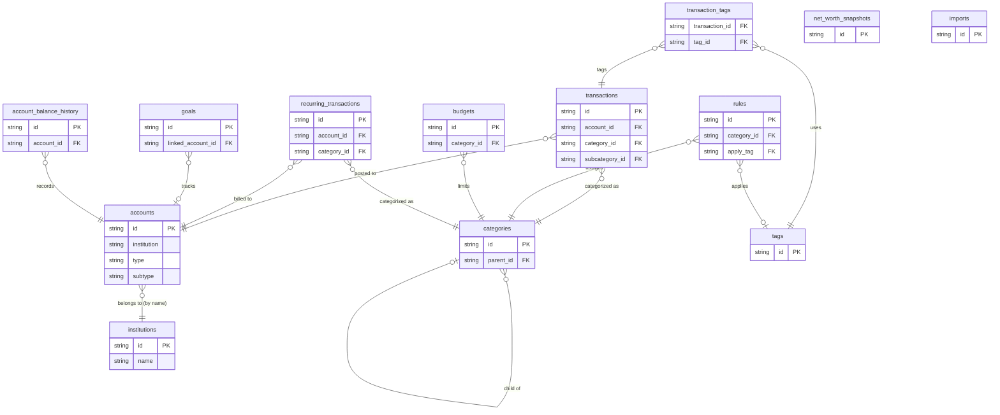

# Data Models

> All data lives in CSV files under `/data/`. At startup, DuckDB WASM loads every file into an in-memory relational database via `src/shared/db/client.ts`. The schema is inferred by DuckDB from the CSV content — there are no explicit `CREATE TABLE` DDL statements.

---

## Amount Sign Convention

Throughout the schema, monetary amounts follow a consistent sign convention:

| Sign | Meaning | Examples |
|------|---------|---------|
| **Negative** | Money leaving an account (expense/debit) | Groceries, rent, subscriptions |
| **Positive** | Money entering an account (income/credit) | Paycheck, refunds, interest |

This applies to `transactions.amount`, `recurring_transactions.amount`, and `accounts.balance` (credit cards show a negative balance equal to the amount currently owed).

---

## Entity Relationships



---

## Tables

### `accounts`

Financial accounts — checking, savings, credit cards, and investment accounts. The central entity that most other tables relate to.

| Field | Type | Description |
|-------|------|-------------|
| `id` | string PK | Unique identifier. Format: `acc_XXX`. |
| `name` | string | Display name, e.g. "Chase Checking". |
| `institution` | string | Institution name string, e.g. "Chase". Matches `institutions.name` but is not a hard foreign key. |
| `type` | string | Top-level account type: `depository`, `credit`, `investment`. |
| `subtype` | string | More specific type: `checking`, `savings`, `credit card`, `brokerage`. |
| `currency` | string | ISO 4217 currency code, e.g. `USD`. |
| `balance` | decimal | Current balance. Negative for credit accounts = amount currently owed. |
| `available_balance` | decimal \| null | Available balance after holds. For credit cards, this is the available credit remaining. |
| `credit_limit` | decimal \| null | Credit limit for credit accounts. Null for non-credit accounts. |
| `is_hidden` | boolean | Excluded from UI displays and most queries when `true`. |
| `is_closed` | boolean | Account is closed. Excluded from active account queries. |
| `last_synced_at` | timestamp | When data was last pulled from the source institution. |
| `created_at` | timestamp | Record creation time. |
| `updated_at` | timestamp | Record last-modified time. |

**Relationships:** Referenced by `transactions`, `recurring_transactions`, `account_balance_history`, and optionally `goals`.

---

### `transactions`

Individual financial transactions. The most queried table in the app.

| Field | Type | Description |
|-------|------|-------------|
| `id` | string PK | Unique identifier. Format: `txn_XXX`. |
| `account_id` | string FK → `accounts.id` | Account the transaction was posted to. |
| `external_id` | string \| null | Original ID from the bank or import source. Used for deduplication. |
| `amount` | decimal | Transaction amount. Negative = expense, positive = income. See sign convention above. |
| `currency` | string | ISO 4217 currency code. |
| `date` | date | Posted/settlement date. Format: `YYYY-MM-DD`. |
| `authorized_date` | date \| null | Authorization date, which may precede the posted date by 1–3 days. |
| `merchant` | string | Cleaned merchant name, e.g. "Whole Foods Market". |
| `description` | string \| null | Raw bank transaction description before merchant parsing. |
| `category_id` | string FK → `categories.id` | Assigned category. |
| `subcategory_id` | string \| null | More specific sub-category. Currently a stub field; not used in active queries. |
| `transaction_type` | string \| null | `debit` or `credit` as reported by the bank. |
| `pending` | boolean | `true` = transaction is authorized but not yet settled. Pending transactions may change amount or be cancelled. |
| `is_transfer` | boolean | `true` = money moved between two owned accounts (e.g. checking → savings). Transfers should be excluded from income/expense totals. |
| `transfer_group` | string \| null | Groups the two legs of a transfer together. Both the debit and credit side share the same `transfer_group` value. |
| `notes` | string \| null | User-written notes attached to the transaction. |
| `tags` | string \| null | Comma-separated tag IDs as a denormalized string, e.g. `"tag_tax,tag_reimbursable"`. The normalized form of this relationship lives in `transaction_tags`. |
| `location` | string \| null | Merchant location string, e.g. "New York, NY". |
| `created_at` | timestamp | Record creation time (import time). |
| `updated_at` | timestamp | Record last-modified time. |

**Relationships:** Belongs to `accounts`. Belongs to `categories`. Many-to-many with `tags` via `transaction_tags`.

> **Note on `tags`:** This field is a convenience denormalization. `transaction_tags` is the authoritative source for tag relationships. Queries that need to filter or join on tags should use `transaction_tags`.

---

### `categories`

Two-level hierarchy of transaction categories. Top-level categories (e.g. "Food & Dining") group related sub-categories (e.g. "Groceries", "Restaurants").

| Field | Type | Description |
|-------|------|-------------|
| `id` | string PK | Unique identifier. Format: `cat_XXX`. |
| `name` | string | Display name, e.g. "Groceries". |
| `parent_id` | string \| null FK → `categories.id` | Parent category ID. `null` for top-level categories. Enables the two-level hierarchy. |
| `icon` | string \| null | Reserved for an emoji or icon identifier. Currently unused. |
| `color` | string | Hex color code for UI display, e.g. `#fb923c`. |
| `system` | boolean | `true` = built-in category shipped with the app. `false` = user-created. System categories cannot be deleted. |
| `created_at` | timestamp | Record creation time. |

**Relationships:** Self-referential via `parent_id`. Referenced by `transactions`, `rules`, `budgets`, and `recurring_transactions`.

**Hierarchy example:**
```
Food & Dining (parent_id = null)
├── Groceries      (parent_id = cat_food)
├── Restaurants    (parent_id = cat_food)
└── Coffee Shops   (parent_id = cat_food)
```

---

### `rules`

Auto-categorization rules applied when transactions are imported. Rules are evaluated in `priority` order; the first matching rule wins.

| Field | Type | Description |
|-------|------|-------------|
| `id` | string PK | Unique identifier. Format: `rule_XXX`. |
| `priority` | integer | Evaluation order. Lower number = checked first. |
| `field` | string | Transaction field to match against: `merchant`, `description`. |
| `operator` | string | Match operator: `contains`, `equals`, `starts_with`. |
| `value` | string | Value to match against the specified field. Case-insensitive. |
| `category_id` | string FK → `categories.id` | Category to assign when the rule matches. |
| `apply_tag` | string \| null FK → `tags.id` | Tag to apply when the rule matches. Optional. |
| `enabled` | boolean | `false` = rule is inactive and skipped during evaluation. |
| `created_at` | timestamp | Record creation time. |

**Relationships:** References `categories` (the category to assign) and optionally `tags` (a tag to apply).

---

### `budgets`

Spending limits per category for a given time period. Used to track whether spending is on track.

| Field | Type | Description |
|-------|------|-------------|
| `id` | string PK | Unique identifier. Format: `bud_XXX`. |
| `category_id` | string FK → `categories.id` | The category this budget covers. One budget per category per period. |
| `amount` | decimal | Budget limit for the period (positive). |
| `period` | string | Budget period: `monthly`, `weekly`, `annual`. |
| `rollover` | boolean | If `true`, unspent budget from the previous period carries forward. Currently stored but not yet implemented in the UI. |
| `start_date` | date | Date the budget becomes active. Format: `YYYY-MM-DD`. |
| `end_date` | date \| null | Date the budget expires. `null` = ongoing with no end date. |
| `created_at` | timestamp | Record creation time. |

**Relationships:** References `categories`. To calculate budget utilization, join with `transactions` on `category_id` and filter by date range matching the `period`.

---

### `recurring_transactions`

Detected recurring charges and income streams (subscriptions, bills, paychecks). These are predicted future transactions based on past patterns.

| Field | Type | Description |
|-------|------|-------------|
| `id` | string PK | Unique identifier. Format: `rec_XXX`. |
| `merchant` | string | Merchant name for the recurring charge or income. |
| `amount` | decimal | Expected amount per occurrence. Negative = recurring expense, positive = recurring income. |
| `frequency` | string | Recurrence frequency: `monthly`, `biweekly`, `weekly`, `annual`. |
| `next_due_date` | date | Predicted date of the next occurrence. |
| `category_id` | string FK → `categories.id` | Category for this recurring item. |
| `account_id` | string FK → `accounts.id` | Account this recurring item is typically charged to or deposited into. |
| `confidence` | decimal (0–1) | Confidence score from the detection algorithm. `0.99` = very confident, `0.85` = lower confidence. |
| `active` | boolean | `false` = no longer tracking (e.g. subscription cancelled). |
| `created_at` | timestamp | Record creation time. |

**Relationships:** References `accounts` and `categories`.

---

### `account_balance_history`

Daily balance snapshots per account. Used to render balance trend charts.

| Field | Type | Description |
|-------|------|-------------|
| `id` | string PK | Unique identifier. Format: `abh_XXX`. |
| `account_id` | string FK → `accounts.id` | The account this snapshot belongs to. |
| `date` | date | Snapshot date. Format: `YYYY-MM-DD`. |
| `balance` | decimal | Account balance on this date. Negative for credit accounts = amount owed on that date. |

**Relationships:** References `accounts`. One row per account per date. Query this table to plot a balance over time chart for a given account.

---

### `net_worth_snapshots`

Daily snapshots of total net worth across all accounts. Pre-aggregated — does not need to join other tables to render a net worth chart.

| Field | Type | Description |
|-------|------|-------------|
| `id` | string PK | Unique identifier. Format: `nw_XXX`. |
| `date` | date | Snapshot date. Format: `YYYY-MM-DD`. |
| `assets` | decimal | Total of all positive-balance account balances (checking, savings, investments). |
| `liabilities` | decimal | Total amount owed across all credit accounts (stored as a positive number). |
| `net_worth` | decimal | `assets - liabilities`. |
| `created_at` | timestamp | Record creation time. |

**Relationships:** None. Standalone pre-computed aggregate. Values should equal the sum derived from `accounts` at the same point in time.

---

### `goals`

Savings goals with a target amount and optional link to a specific account.

| Field | Type | Description |
|-------|------|-------------|
| `id` | string PK | Unique identifier. Format: `goal_XXX`. |
| `name` | string | Goal name, e.g. "Emergency Fund". |
| `target_amount` | decimal | Amount needed to complete the goal. |
| `current_amount` | decimal | Current progress toward the goal. When `linked_account_id` is set, this should equal that account's balance. |
| `target_date` | date | Target completion date. Format: `YYYY-MM-DD`. |
| `linked_account_id` | string \| null FK → `accounts.id` | Optional account whose balance is used to track progress (e.g. a dedicated savings account). When null, `current_amount` is manually set. |
| `created_at` | timestamp | Record creation time. |

**Relationships:** Optionally references `accounts`.

---

### `tags`

User-defined labels that can be applied to transactions for cross-category tracking (e.g. "Tax Deductible", "Reimbursable").

| Field | Type | Description |
|-------|------|-------------|
| `id` | string PK | Unique identifier. Format: `tag_XXX`. |
| `name` | string | Display name, e.g. "Tax Deductible". |
| `color` | string | Hex color code for UI display. |

**Relationships:** Referenced by `transaction_tags` (applied to transactions) and `rules` (auto-applied by rules).

---

### `transaction_tags`

Junction table for the many-to-many relationship between transactions and tags.

| Field | Type | Description |
|-------|------|-------------|
| `transaction_id` | string FK → `transactions.id` | The tagged transaction. |
| `tag_id` | string FK → `tags.id` | The tag applied to the transaction. |

**Primary key:** Composite `(transaction_id, tag_id)`.

**Relationships:** Links `transactions` to `tags`. A transaction can have many tags; a tag can be applied to many transactions.

> **Note:** `transactions.tags` (a comma-separated string) is a denormalized copy of this data. Use this table for joins and filtering; treat `transactions.tags` as a display convenience only.

---

### `institutions`

Reference data for financial institutions. Currently used to store branding (name, color) for display purposes.

| Field | Type | Description |
|-------|------|-------------|
| `id` | string PK | Unique identifier. Format: `inst_XXX`. |
| `name` | string | Institution name, e.g. "Chase". Matches `accounts.institution` but there is no enforced foreign key. |
| `logo` | string \| null | URL or base64-encoded logo image. Currently unpopulated. |
| `primary_color` | string | Brand hex color, e.g. `#117ACA`. Used for institution avatars in the UI. |

**Relationships:** Loosely related to `accounts.institution` by name string. There is no hard FK constraint — `accounts.institution` stores the institution name as a plain string, not `institutions.id`.

---

### `imports`

Audit log of data import operations. Tracks what was imported, when, and from where.

| Field | Type | Description |
|-------|------|-------------|
| `id` | string PK | Unique identifier. Format: `imp_XXX`. |
| `source` | string | Import method: `csv_upload`, or a future integration name (e.g. `plaid`). |
| `imported_at` | timestamp | When the import was executed. |
| `file_hash` | string | MD5 or SHA hash of the source file. Used to detect and reject duplicate imports. |
| `transaction_count` | integer | Number of transactions in this import batch. |

**Relationships:** None. Standalone audit record.

---

## Relationship Summary

| Relationship | Type | Notes |
|---|---|---|
| `transactions` → `accounts` | many-to-one | Every transaction belongs to one account |
| `transactions` → `categories` | many-to-one | Every transaction has one category |
| `transactions` ↔ `tags` | many-to-many | Via `transaction_tags` junction table |
| `categories` → `categories` | self-referential | `parent_id` creates a two-level hierarchy |
| `rules` → `categories` | many-to-one | Rule assigns a category on match |
| `rules` → `tags` | many-to-one (optional) | Rule may also apply a tag |
| `budgets` → `categories` | many-to-one | One budget per category |
| `recurring_transactions` → `accounts` | many-to-one | Recurring item billed to an account |
| `recurring_transactions` → `categories` | many-to-one | Recurring item has a category |
| `account_balance_history` → `accounts` | many-to-one | Many daily snapshots per account |
| `goals` → `accounts` | many-to-one (optional) | Goal optionally tracks an account balance |
| `accounts` → `institutions` | many-to-one (by name, no FK) | `accounts.institution` matches `institutions.name` |
